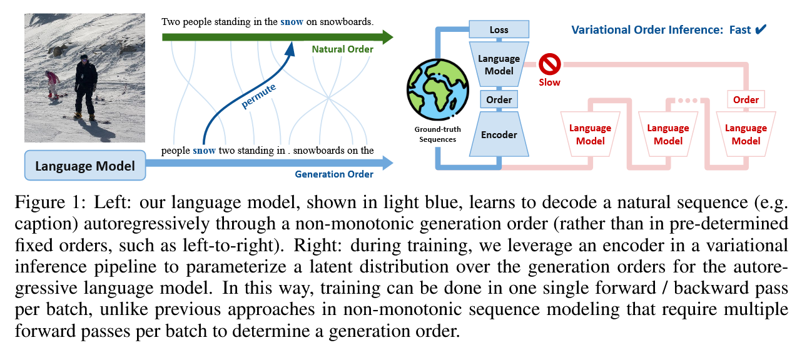
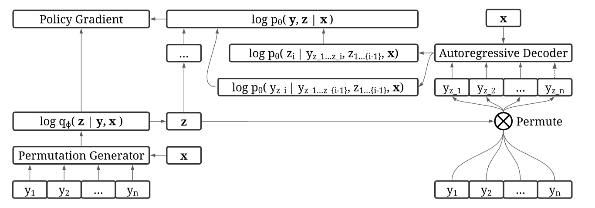
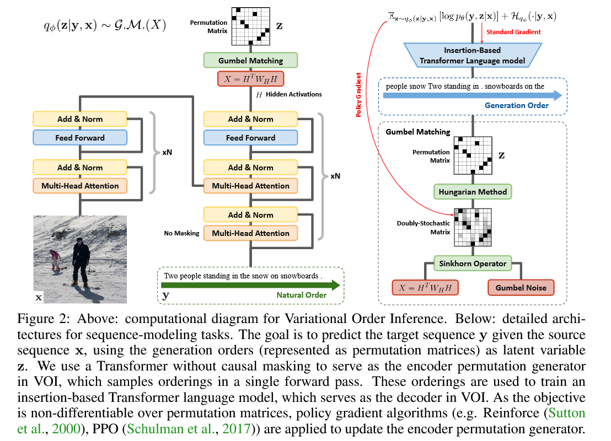

# Discovering Non-monotonic Autoregressive Orderings with Variational Inference

## Description

This package contains the source code implementation of the paper "Discovering Non-monotonic Autoregressive Orderings with Variational Inference" [(paper)](https://arxiv.org/abs/2110.15797).

Inferring good generation orders in natural sequences is challenging. In our main contribution, we propose Variational Order Inference (VOI), which can be efficiently trained to discover autoregressive sequence generation orders in a data driven way without a domain-specific prior.

In VOI, the encoder permutation generator generates non-monotonic autoregressive orders as the latent variable, and the decoder autoregressive (language) model maximizes the joint probability of generating the target sequence under these non-monotonic orders. In conditional text generation tasks, the encoder is implemented as Transformer with non-causal attention, and the decoder is implemented as Transformer-InDIGO (Gu et al., 2019) which generates target sequences through insertion.





- [Discovering Non-monotonic Autoregressive Orderings with Variational Inference](#discovering-non-monotonic-autoregressive-orderings-with-variational-inference)
  - [Description](#description)
  - [Installation](#installation)
  - [Configure tensorflow-hungarian](#configure-tensorflow-hungarian)
  - [Setup](#setup)
    - [Captioning](#captioning)
    - [Django](#django)
    - [Gigaword](#gigaword)
    - [WMT](#wmt)
  - [Training](#training)
  - [Validation, Test, and Visualization](#validation-test-and-visualization)
  - [Pretrained Models](#pretrained-models)
  - [Citations](#citations)

## Installation

To install this package, first download the package from github, then install it using pip. For CUDA 10.1 (as configured in `setup.py`), the package versions are Tensorflow 2.3 and PyTorch 1.5, with their corresponding `tensorflow_probability` and `torchvision` versions. For CUDA 11.0, you may need to change the package versions in `setup.py` to be `tensorflow==2.4`, `torch==1.6`, `tensorflow_probability==0.12.1`, and `torchvision==0.7.0`.

```bash
git clone https://github.com/xuanlinli17/autoregressive_inference
cd autoregressive_inference
pip install -e .
```

Install helper packages for word tokenization and part of speech tagging. Enter the following statements into the python interpreter where you have installed our package.

```python
import nltk
nltk.download('punkt')
nltk.download('brown')
nltk.download('universal_tagset')
```

Install `nlg-eval` that contains several helpful metrics for evaluating image captioning. Tasks other than captioning are evaluated through the `vizseq` package we already installed through `setup.py`.

```bash
pip install git+https://github.com/Maluuba/nlg-eval.git@master
nlg-eval --setup
```

Clone `wmt16-scripts` for machine translation preprocessing.

```
git clone https://github.com/rsennrich/wmt16-scripts
```

## Configure tensorflow-hungarian

During training, one process of order inference is to obtain permutation matrices from doubly stochastic matrices. This is accomplished through the Hungarian algorithm. Since `tf.py_function` only allows one gpu to run the function at any time, multi-gpu training is very slow if we use `scipy.optimize.linear_sum_assignment` (which requires wrapping it with `tf.py_function` to call). Therefore, we use a pre-written Hungarian-op script and compile it through g++ into dynamic library. During runtime, we can import the dynamic library using tensorflow api. This leads to much faster distributed training.

```bash
git clone https://github.com/brandontrabucco/tensorflow-hungarian
cd tensorflow-hungarian
make hungarian_op
```
If you encounter `fatal error: third_party/gpus/cuda/include/cuda_fp16.h: No such file or directory`, this could be resolved via [link](https://github.com/tensorflow/tensorflow/issues/31912#issuecomment-547475301). The generated op could be found in `tensorflow-hungarian/tensorflow_hungarian/python/ops/_hungarian_ops.so`

Alternatively, we could also generate the op from the repo `munkres-tensorflow`. 
```bash
git clone https://github.com/mbaradad/munkres-tensorflow
TF_CFLAGS=( $(python -c 'import tensorflow as tf; print(" ".join(tf.sysconfig.get_compile_flags()))') )
TF_LFLAGS=( $(python -c 'import tensorflow as tf; print(" ".join(tf.sysconfig.get_link_flags()))') )
g++ -std=c++11 -shared munkres-tensorflow/hungarian.cc -o hungarian.so -fPIC ${TF_CFLAGS[@]} ${TF_LFLAGS[@]} -O2
```
However, this function requires all entries in a matrix to be different (otherwise some strange behaviors will occur), so we also need to uncomment the line `sample_permu = sample_permu * 1000 + tf.random.normal(tf.shape(sample_permu)) * 1e-7` in `voi/nn/layers/permutation_sinkhorn.py`

## Setup

### Captioning

In this section, we will walk you through how to create a training dataset, using COCO 2017 as an example. In the first step, download COCO 2017 [here](https://cocodataset.org/#download). Place the extracted `.json` annotations at `~/annotations` and the images at `~/train2017` and `~/val2017` for the training and validation set respectively.

Create a part of speech tagger first. This information is used to visualize the generation orders of captions learnt by our model, and is not used during training.

```bash
cd {this_repo}
python scripts/data/create_tagger.py --out_tagger_file tagger.pkl
```

Extract COCO 2017 into a format compatible with our package. There are several arguments that you can specify to control how the dataset is processed. You may leave all arguments as default except `out_caption_folder` and `annotations_file`.

```bash
python scripts/data/extract_coco.py --out_caption_folder ~/captions_train2017 --annotations_file ~/annotations/captions_train2017.json
python scripts/data/extract_coco.py --out_caption_folder ~/captions_val2017 --annotations_file ~/annotations/captions_val2017.json
```

Process the COCO 2017 captions and extract integer features on which to train a non sequential model. There are again several arguments that you can specify to control how the captions are processed. You may leave all arguments as default except `out_feature_folder` and `in_folder`, which depend on where you extracted the COCO dataset in the previous step. Note that if `vocab_file` doesn't exist before, it will be automatically generated. Since we have provided the `train2017_vocab.txt` we used to train our model, this vocab file will be directly loaded to create integer representations of tokens.

```bash
python scripts/data/process_captions.py --out_feature_folder ~/captions_train2017_features --in_folder ~/captions_train2017 \
--tagger_file tagger.pkl --vocab_file train2017_vocab.txt --min_word_frequency 5 --max_length 100
python scripts/data/process_captions.py --out_feature_folder ~/captions_val2017_features --in_folder ~/captions_val2017 \
--tagger_file tagger.pkl --vocab_file train2017_vocab.txt --max_length 100
```

Process images from the COCO 2017 dataset and extract features using a pretrained Faster RCNN FPN backbone from pytorch checkpoint. Note this script will distribute inference across all visible GPUs on your system. There are several arguments you can specify, which you may leave as default except `out_feature_folder` and `in_folder`, which depend on where you extracted the COCO dataset.

```bash
python scripts/data/process_images.py --out_feature_folder ~/train2017_features --in_folder ~/train2017 --batch_size 4
python scripts/data/process_images.py --out_feature_folder ~/val2017_features --in_folder ~/val2017 --batch_size 4
```

Finally, convert the processed features into a TFRecord format for efficient training. Record where you have extracted the COCO dataset in the previous steps and specify `out_tfrecord_folder`, `caption_folder` and `image_folder` at the minimum.

```bash
python scripts/data/create_tfrecords_captioning.py --out_tfrecord_folder ~/train2017_tfrecords \
--caption_folder ~/captions_train2017_features --image_folder ~/train2017_features --samples_per_shard 4096
python scripts/data/create_tfrecords_captioning.py --out_tfrecord_folder ~/val2017_tfrecords \
--caption_folder ~/captions_val2017_features --image_folder ~/val2017_features --samples_per_shard 4096
```

### Django

For convenience, we ran the script from [NL2code](https://github.com/pcyin/NL2code) to extract the cleaned dataset from [drive](https://drive.google.com/drive/folders/0B14lJ2VVvtmJWEQ5RlFjQUY2Vzg) and place them in `django_data`. The vocab file `djangovocab.txt` is also in that directory. Alternatively, you may download raw data from [ase15-django](https://github.com/odashi/ase15-django-dataset) and run `python scripts/data/extract_django.py --data_dir {path to all.anno and all.code)`

Next, process the Django dataset into TFRecord format for efficient training.

```bash
cd {this_repo}

CUDA_VISIBLE_DEVICES=0 python scripts/data/process_django.py --data_folder ./django_data \
--vocab_file ./django_data/djangovocab.txt --dataset_type train/dev/test \
--out_feature_folder ./django_data

CUDA_VISIBLE_DEVICES=0 python scripts/data/create_tfrecords_django.py --out_tfrecord_folder ./django_data \
--dataset_type train/dev/test --feature_folder ./django_data
```

### Gigaword

First, extract the dataset and learn byte-pair encoding.

```bash
cd {this_repo}
CUDA_VISIBLE_DEVICES=0 python scripts/data/extract_gigaword.py --data_dir {dataroot}
cd {dataroot}/gigaword
subword-nmt learn-joint-bpe-and-vocab --input src_raw_train.txt tgt_raw_train.txt -s 32000 -o joint_bpe.code --write-vocabulary src_vocab.txt tgt_vocab.txt
subword-nmt apply-bpe -c joint_bpe.code --vocabulary src_vocab.txt --vocabulary-threshold 50 < src_raw_train.txt > src_train.BPE.txt
subword-nmt apply-bpe -c joint_bpe.code --vocabulary src_vocab.txt --vocabulary-threshold 50 < src_raw_validation.txt > src_validation.BPE.txt
subword-nmt apply-bpe -c joint_bpe.code --vocabulary src_vocab.txt --vocabulary-threshold 50 < src_raw_test.txt > src_test.BPE.txt
subword-nmt apply-bpe -c joint_bpe.code --vocabulary tgt_vocab.txt --vocabulary-threshold 50 < tgt_raw_train.txt > tgt_train.BPE.txt
subword-nmt apply-bpe -c joint_bpe.code --vocabulary tgt_vocab.txt --vocabulary-threshold 50 < tgt_raw_validation.txt > tgt_validation.BPE.txt
subword-nmt apply-bpe -c joint_bpe.code --vocabulary tgt_vocab.txt --vocabulary-threshold 50 < tgt_raw_test.txt > tgt_test.BPE.txt
```

Then, generate the vocab file, and use this vocab file to convert tokens into integers and store in a feature file. Alternately you may use the `gigaword_vocab.txt` provided in our repo, which we used to train our model. To do this, set the following `--vocab_file` argument to be `{this_repo}/gigaword_vocab.txt`. 

```bash
cd {this_repo}
CUDA_VISIBLE_DEVICES=0 python scripts/data/process_gigaword.py --out_feature_folder {dataroot}/gigaword \
--data_folder {dataroot}/gigaword --vocab_file {dataroot}/gigaword/gigaword_vocab.txt (or {this_repo}/gigaword_vocab.txt) \
--dataset_type train/validation/test
```

Finally, generate the train/validation/test tfrecords files.
```bash
CUDA_VISIBLE_DEVICES=0 python scripts/data/create_tfrecords_gigaword.py --out_tfrecord_folder {dataroot}/gigaword \
--feature_folder {dataroot}/gigaword --samples_per_shard 4096 --dataset_type train/validation/test
```


### WMT

Here, we use WMT16 Ro-En as an example.

First extract the dataset and learn byte-pair encoding.
```bash
cd {this_repo}
CUDA_VISIBLE_DEVICES=0 python scripts/data/extract_wmt.py --language_pair 16 ro en --data_dir {dataroot}
cd {dataroot}/wmt16_translate/ro-en
subword-nmt learn-joint-bpe-and-vocab --input src_raw_train.txt tgt_raw_train.txt -s 32000 -o joint_bpe.code --write-vocabulary src_vocab.txt tgt_vocab.txt
subword-nmt apply-bpe -c joint_bpe.code --vocabulary src_vocab.txt --vocabulary-threshold 50 < src_raw_train.txt > src_train.BPE.txt
subword-nmt apply-bpe -c joint_bpe.code --vocabulary src_vocab.txt --vocabulary-threshold 50 < src_raw_validation.txt > src_validation.BPE.txt
subword-nmt apply-bpe -c joint_bpe.code --vocabulary src_vocab.txt --vocabulary-threshold 50 < src_raw_test.txt > src_test.BPE.txt
subword-nmt apply-bpe -c joint_bpe.code --vocabulary tgt_vocab.txt --vocabulary-threshold 50 < tgt_raw_train.txt > tgt_train.BPE.txt
subword-nmt apply-bpe -c joint_bpe.code --vocabulary tgt_vocab.txt --vocabulary-threshold 50 < tgt_raw_validation.txt > tgt_validation.BPE.txt
subword-nmt apply-bpe -c joint_bpe.code --vocabulary tgt_vocab.txt --vocabulary-threshold 50 < tgt_raw_test.txt > tgt_test.BPE.txt
```

Extract corpus with truecase to train the truecaser, which is used for evaluation.

```bash
git clone https://github.com/moses-smt/mosesdecoder
cd {this_repo}
CUDA_VISIBLE_DEVICES=0 python scripts/data/extract_wmt.py --language_pair 16 ro en --data_dir {dataroot} --truecase
{path_to_mosesdecoder}/scripts/recaser/train-truecaser.perl -corpus {dataroot}/wmt16_translate/ro-en/src_truecase_train.txt -model {dataroot}/wmt16_translate/ro-en/truecase-model.ro
{path_to_mosesdecoder}/scripts/recaser/train-truecaser.perl -corpus {dataroot}/wmt16_translate/ro-en/tgt_truecase_train.txt -model {dataroot}/wmt16_translate/ro-en/truecase-model.en
```

Remove the diacritics of Romanian:
```bash
git clone https://github.com/rsennrich/wmt16-scripts
cd {dataroot}/wmt16_translate/ro-en/
python {path_to_wmt16-scripts}/preprocess/remove-diacritics.py < src_train.BPE.txt > src_train.BPE.txt
python {path_to_wmt16-scripts}/preprocess/remove-diacritics.py < src_validation.BPE.txt > src_validation.BPE.txt
python {path_to_wmt16-scripts}/preprocess/remove-diacritics.py < src_test.BPE.txt > src_test.BPE.txt
```

**------------Note-------------**

In practice, training with the sequence-level distillation dataset ([Link](https://arxiv.org/pdf/1606.07947.pdf)) generated using the L2R model with beam size 5 leads to about 2 BLEU improvement on WMT16 Ro-En, intuitively because the target sequences in this new dataset are more consistent. We release the this distilled dataset [here](https://drive.google.com/drive/folders/1HCzeB4ak7mJMrmrEQG0K-TEBU8B8K3To?usp=sharing). To use this dataset, put `src_distillation.BPE.txt` and `tgt_distillation.BPE.txt` in `{dataroot}/wmt16_translate/ro-en/`. Training on this distilled dataset obtains very similar ordering observations (i.e. the model generates all descriptive tokens before generating the auxillary tokens) compared to training on the original dataset.

**-----------------------------**

Generate the vocab file (joint vocab for the source and target languages), and use this vocab file to convert tokens into integers and store in a feature file. Since we forgot to remove the diacritics during our initial experiments and we appended all missing vocabs in the diacritics-removed corpus afterwards, the vocab file we used to train our model is slightly different from the one generated through the scripts below, so we have uploaded the vocab file we used to train our model as `ro_en_vocab.txt`. To use this vocab file, set the following `--vocab_file` argument to be `{this_repo}/ro_en_vocab.txt`
```
cd {this_repo}
CUDA_VISIBLE_DEVICES=0 python scripts/data/process_wmt.py --out_feature_folder {dataroot}/wmt16_translate/ro-en \
--data_folder {dataroot}/wmt16_translate/ro-en --vocab_file {dataroot}/wmt16_translate/ro_en_vocab.txt (or {this_repo}/ro_en_vocab.txt) \
--dataset_type distillation/train/validation/test
```

Finally, generate the distillation/train/validation/test tfrecords files.
```
CUDA_VISIBLE_DEVICES=0 python scripts/data/create_tfrecords_wmt.py --out_tfrecord_folder {dataroot}/wmt16_translate/ro-en \
--feature_folder {dataroot}/wmt16_translate/ro-en --samples_per_shard 4096 --dataset_type distillation/train/validation/test
```

## Training

Please see [training_scripts.md](training_scripts.md) for details about training a model.

## Validation, Test, and Visualization

Please see [evaluation_visualization_scripts.md](evaluation_visualization_scripts.md) for details about validating / testing a model, along with visualizing the generalization orders of a model.

## Pretrained Models

We have provided pretrained models for each task [here](https://drive.google.com/drive/folders/1qGi3sVba-tkPQy-Jm8889UwH7dH3pe4G?usp=sharing). You may make a directory `ckpt_pretrain` under this repo and download them under this directory.

To evaluate the pretrained models and visualize their generalization orders, please see [eval_visualize_pretrained_models.md](eval_visualize_pretrained_models.md) for details.

## Citations

```
@article{li2021autoregressiveinference,
  title={Discovering Non-monotonic Autoregressive Orderings with Variational Inference},
  author={Xuanlin Li and Brandon Trabucco and Dong Huk Park and Michael Luo and Sheng Shen and Trevor Darrell and Yang Gao},
  booktitle={International Conference on Learning Representations},
  year={2021}  
}
```
